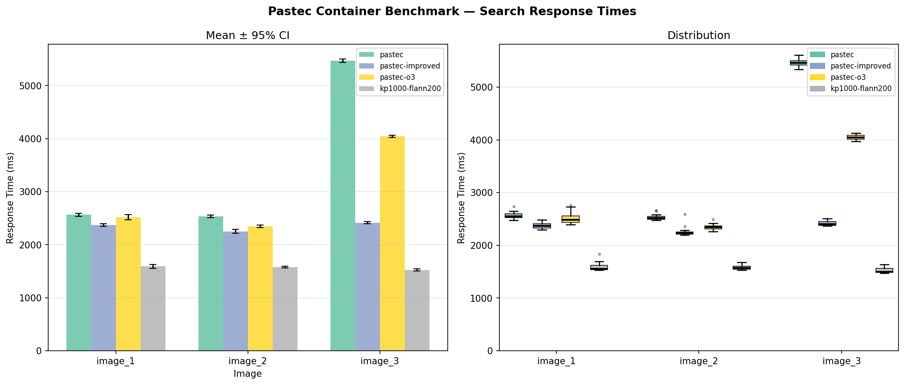

# Benchmark Results

**Date**: 2026-06-15 14:40  
**Iterations per image**: 20  
**Confidence interval**: 95% (z = 1.96)

| Container         | Image   | Mean (ms) | Median (ms) | P95 (ms) | Std Dev | 95% CI (±ms) |
| ----------------- | ------- | --------: | ----------: | -------: | ------: | -----------: |
| `pastec`          | image_1 |    2565.3 |      2548.5 |   2652.0 |    64.8 |        ±28.4 |
| `pastec`          | image_2 |    2531.2 |      2518.4 |   2648.8 |    52.9 |        ±23.2 |
| `pastec`          | image_3 |    5468.1 |      5459.2 |   5592.9 |    75.7 |        ±33.2 |
| `pastec-improved` | image_1 |    2374.1 |      2369.9 |   2484.4 |    56.9 |        ±24.9 |
| `pastec-improved` | image_2 |    2251.6 |      2227.7 |   2368.5 |    88.7 |        ±38.9 |
| `pastec-improved` | image_3 |    2413.5 |      2401.5 |   2473.6 |    42.8 |        ±18.8 |
| `pastec-o3`       | image_1 |    2514.7 |      2482.4 |   2730.5 |   110.2 |        ±48.3 |
| `pastec-o3`       | image_2 |    2345.7 |      2345.2 |   2423.6 |    53.9 |        ±23.6 |
| `pastec-o3`       | image_3 |    4044.7 |      4042.5 |   4102.5 |    47.0 |        ±20.6 |
| `kp1000-flann200` | image_1 |    1590.4 |      1553.3 |   1700.8 |    77.7 |        ±34.0 |
| `kp1000-flann200` | image_2 |    1578.6 |      1570.5 |   1645.9 |    41.9 |        ±18.4 |
| `kp1000-flann200` | image_3 |    1523.6 |      1499.6 |   1610.5 |    51.2 |        ±22.4 |

## Changesets

- **`pastec`** — Original upstream pastec (Ubuntu 17.04, OpenCV 2). Baseline reference.
- **`pastec-improved`** — Fork with a reduced RANSAC reranking pool and tighter match-distance threshold, cutting the expensive geometric verification step.
- **`pastec-o3`** — Recompiled with `-O3` and `-march=native` to isolate the compiler-optimisation gain.
- **`kp1000-flann200`** — Keypoints halved (2000→1000), reducing ORB extraction and FLANN lookups proportionally; FLANN vocabulary-search depth cut 10× (SearchParams 2000→200).

